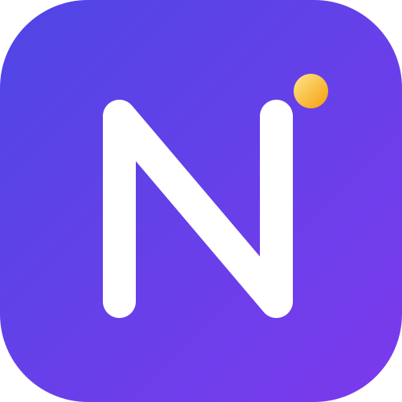

<p align="center">
  
</p>

<h1 align="center">Nudge</h1>

<p align="center">
  <strong>Don't parse your agents. Nudge them.</strong><br>
  A typed, replayable, budget-aware programming language for LLM agents — compiles to Python.
</p>

<p align="center">
  
  
  
  
</p>

---

## Why Nudge exists

Production agents in 2026 are still held together with Python glue: prompt chains parsed by hand, tool calls wrapped in try/except, no replay, no cost control, no regression tests. Libraries patch symptoms. **Nudge fixes the layer where the problem actually lives: the language.**

| Pain | Libraries | Nudge |
|---|---|---|
| Untyped LLM output | validate at runtime | schema is a type — proven at compile time |
| Hidden side effects | invisible | `uses LLM, Tool, IO` in every signature |
| No regression testing | record/replay bolted on | every run emits a trace; every trace is a test |
| Cost surprises | dashboards after the fact | budget is a contract, enforced by compiler + runtime |
| Async fan-out spaghetti | manual asyncio | `par map / race / all`, race safety proven |

## A taste

```
type Finding = { claim: string, source: Url, confidence: float @range(0, 1) }

fn analyze(q: string, hits: [SearchResult]) -> [Finding] uses LLM {
    llm"""Extract verifiable findings about {q} from: {hits}"""
    with { schema: [Finding], model: "anthropic:sonnet-4.6",
           budget: 0.03 USD, retry: 2 with repair }
}

test "stays within budget on recorded trace" {
    let t = replay("traces/demo.jsonl")
    assert t.cost_usd < 0.25          // zero tokens burned in CI
}
```

The compiler proves the schema matches, infers effects, and computes a static cost bound. The runtime records every call to a content-addressed trace you can diff, commit, and replay.

## Guarantees at a glance

- **Typed LLM calls** — output schema is a language type; violations trigger automatic repair, never reach your code.
- **Effect system** — pure / `LLM` / `Tool` / `IO` effects inferred and shown in signatures.
- **Deterministic replay** — full, hybrid, and live modes; traces are git-friendly JSONL.
- **Budget contracts** — per-call and per-run USD ceilings with static estimation.
- **Checkpointed agent state** — crash, then `nudge resume` from the last checkpoint.
- **Native parallelism** — `par map`, `par race`, `par all` with compile-time race safety.
- **MCP & Python interop** — consume MCP servers as typed tools; escape to any pip package.

## Status

Pre-alpha. The language design is complete ([docs/design.md](docs/design.md), v1.1); the compiler is under active development ([docs/roadmap.md](docs/roadmap.md)). Currently at **day 1–3 of the MVP plan**: lexer and parser done, `hello llm` codegen next.

## The name

*Nudge* — a small, intentional push. That is what a well-typed prompt really is: you don't command an LLM and parse whatever comes back, you nudge it into a schema and let the language enforce the rest. Files use the `.ndg` extension.

Documentation is in English; Simplified Chinese docs are planned after v0.1.

## Documentation

- [Language design](docs/design.md) — types, effects, replay, budgets, compiler architecture
- [Roadmap](docs/roadmap.md) — MVP plan and v0.1→v1.0 milestones
- [Examples](examples/) — the self-testing research agent

## License

MIT — see [LICENSE](LICENSE).
