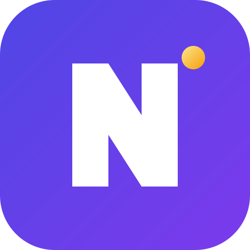

<p align="center">
  
</p>

<h1 align="center">Nudge</h1>

<p align="center">
  <strong>不要解析你的代理，引导它们。</strong><br>
  一个类型化、可重放、预算感知的 LLM 代理编程语言。<br>
  编译为 Python 和 TypeScript。
</p>

<p align="center">
  
  
  
  
  <a href="https://marketplace.visualstudio.com/items?itemName=Nekomya.nudge-lang"></a>
</p>

---

<p align="center">
  <a href="README.md">English</a> •
  <a href="README.zh-CN.md">中文</a>
</p>

---

## 为什么选择 Nudge？

生产环境的代理仍然由胶水代码拼凑而成：手动解析的提示链、try/except 包装的工具调用、没有重放、没有成本控制、没有回归测试。库只是修补症状。**Nudge 从问题真正所在的层面解决：语言层面。**

| 痛点 | 库 | Nudge |
|---|---|---|
| 无类型的 LLM 输出 | 运行时验证 | 模式是类型 — 编译时证明 |
| 隐藏的副作用 | 不可见 | 每个签名中的 `uses LLM, Tool, IO` |
| 没有回归测试 | 事后添加记录/重放 | 每次运行产生跟踪；每个跟踪都是测试 |
| 成本意外 | 事后仪表板 | 预算是编译器+运行时强制执行的契约 |
| 异步扇出混乱 | 手动 asyncio | `par map / race / all`，编译时竞态安全 |

## Nudge 代码示例

```
type Finding = { claim: string, source: Url, confidence: float @range(0, 1) }

fn analyze(q: string, hits: [SearchResult]) -> [Finding] uses LLM {
    llm"""从 {hits} 中提取关于 {q} 的可验证发现"""
    with { schema: [Finding], model: "anthropic:sonnet-4.6",
           budget: 0.03 USD, retry: 2 with repair }
}

test "stays within budget on recorded trace" {
    let t = replay("traces/demo.jsonl")
    assert t.cost_usd < 0.25          // CI 中零 token 消耗
}
```

编译器证明模式匹配、推断效果并计算静态成本边界。运行时将每次调用记录到可寻址的跟踪中，你可以 diff、提交和重放。

## 功能特性

<div align="center">

| 功能 | 描述 |
|:---:|:---|
| **类型化 LLM 调用** | 输出模式是语言类型；违规触发自动修复 |
| **效果系统** | 纯函数 / `LLM` / `Tool` / `IO` 效果推断并显示在签名中 |
| **确定性重放** | 完整、混合和实时模式；跟踪是 git 友好的 JSONL |
| **预算契约** | 每次调用、每次运行和每次修复的 USD 上限，带静态估算 |
| **检查点恢复** | 崩溃后，从最后一个检查点 `nudge resume` |
| **原生并行** | `par map`、`par race`、`par all`，编译时竞态安全 |
| **提示 Clippy** | 编译器 lint 你的 `llm"""` 块：模糊指令、缺失契约 |
| **MCP 和 Python 互操作** | 通过 stdio 消费真实 MCP 服务器；可使用任何 pip 包 |
| **真实提供商** | OpenAI / Gemini / Groq / MiMo / Mistral / Anthropic / Ollama |
| **跟踪查看器** | 本地 Web UI：时间线、token、成本、修复高亮 |
| **跟踪差异** | 比较两个跟踪："编辑提示后什么改变了？" |
| **A2A 和 LSP 和 OTel** | 内置，非外挂 |

</div>

## 快速开始

### 安装

**一键安装（推荐）：**

```sh
# Linux / macOS
curl -fsSL https://raw.githubusercontent.com/NekomyaDev/nudge/main/install.sh | bash

# Windows（以管理员身份运行 PowerShell）
irm https://raw.githubusercontent.com/NekomyaDev/nudge/main/install.ps1 | iex
```

**包管理器：**

```sh
# Snap (Linux)
sudo snap install nudge --classic

# Docker
docker run -it --rm -v $(pwd):/workspace nekomyadev/nudge nudgec --help
```

**GUI 安装器（双击）：**

- **Windows：** 下载 [`install.bat`](https://github.com/NekomyaDev/nudge/releases/download/v1.2.0/install.bat) 并双击
- **macOS：** 下载 [`install.command`](https://github.com/NekomyaDev/nudge/releases/download/v1.2.0/install.command) 并双击

**手动安装：**

从 [Releases](https://github.com/NekomyaDev/nudge/releases) 页面下载：

| 平台 | 文件 |
|:---|:---|
| Linux x86_64 | `nudgec-v1.2.0-linux-x86_64.tar.gz` |
| macOS x86_64 | `nudgec-v1.2.0-macos-x86_64.tar.gz` |
| macOS Apple Silicon | `nudgec-v1.2.0-macos-aarch64.tar.gz` |
| Windows x86_64 | `nudgec-v1.2.0-windows-x86_64.zip` |

```sh
# Linux/macOS
tar xzf nudgec-*.tar.gz
chmod +x nudgec
sudo mv nudgec /usr/local/bin/

# Windows
# 解压 zip 并添加到 PATH
```

### 你的第一个 Nudge 程序

安装生成的代码所导入的 Python 运行时：

```sh
pip install nudge-runtime   # 纯标准库，无依赖
```

```sh
# 创建程序
cat > hello.ndg << 'EOF'
type Greeting = { message: string, timestamp: string }

fn greet(name: string) -> Greeting uses LLM {
    llm"""为 {name} 创建一个问候。返回 message 和 timestamp。"""
    with { schema: Greeting, model: "anthropic:sonnet-4.6", budget: 0.01 USD }
}
EOF

# 类型检查
nudgec check hello.ndg

# 编译为 Python
nudgec build hello.ndg

# 运行（无需 API 密钥 - 使用假提供商）
python3 out/hello.py
```

默认情况下，所有内容都针对确定性假提供商运行：**无需 API 密钥，无需 token 消耗。**

### 你的第一个决策（5 分钟）

`decide{}` 就某个状态向决策模型提出类型化的问题 —— 一次批量调用，
答案带概率和置信度。先从假提供商开始（无需服务器、无需密钥）：

```sh
cat > first-decision.ndg << 'NDEOF'
fn route_ticket(t: string) -> string uses Decision {
    let d = decide {
        dept: "which team handles this?" choose [billing, technical, security],
        urgent: "is this urgent?" yes/no
    }
    on t
    route { auto:  d.dept.winner when d.dept.confidence > 0.5,
            human: "escalate to a human" otherwise }
}
NDEOF

nudgec check first-decision.ndg && nudgec build first-decision.ndg
python3 out/first-decision.py   # 确定性、$0、离线
```

要使用**真实**决策模型（Laya / Jev 家族）回答，只需一行把注册表指向
运行中的 `/v1/systemone` 服务器：

```sh
export NUDGE_DECISION_SERVERS='{"laya": {"base_url": "http://localhost:8000"}}'
```

对照真实 Laya 0.3.20 编码器的实测（同一程序、3 个问题）：
`dept=technical p=0.866`、`churn=0.768`、`urgency=1.91` —— **每次决策
约 51 毫秒**（含 HTTP），约为托管 Jev API 的 5 倍快。每个决策都会连同
其延迟写入 NTF trace，重放为 $0，而 `NUDGE_DECISION_CACHE` 让你永远
不会为同一个决策付两次费。参见[类型化决策](#类型化决策-v14)。

## 真实示例

看看用 Nudge 能构建什么：

| 示例 | 描述 | 特性 |
|:---|:---|:---|
| [AI 聊天机器人](examples/chatbot/) | 带记忆的对话代理 | 类型化 LLM、重放、预算 |
| [代码审查器](examples/code-reviewer/) | 代码质量分析器 | 结构化输出、评分 |
| [研究代理](examples/research-agent/) | 多来源研究 | 置信度评分、Par map |
| [数据分析器](examples/data-analyzer/) | 数据模式识别 | 洞察、建议 |
| [翻译器](examples/translator/) | 多语言翻译 | 质量评分、并行 |

```sh
# 试试任何示例
cd examples/chatbot
nudgec check chatbot.ndg && nudgec build chatbot.ndg
python3 out/chatbot.py
```

## 后端对等性

| 功能 | Python | TypeScript |
|:---|:---:|:---:|
| 类型化调用、模式验证、修复 | ✅ | ✅ |
| 跟踪、重放、预算墙 | ✅ | ✅ |
| `par map/all/race` + 分支标签 | ✅ | ✅ |
| 流式传输（`stream let`） | ✅ | ✅ |
| 真实提供商 | ✅ | ⬜ |
| MCP 工具、检查点/恢复、OTel | ✅ | ⬜ |

## MCP 集成

声明 `impl: mcp("server").tool` 的工具通过 stdio 与真实的 MCP 服务器通信。本节记录截至 v1.2.1 的契约。

### 声明和调用 MCP 工具

```nudge
type Result = { url: string, title: string }

tool web_search(query: string) -> [Result] {
    impl: mcp("search").web_search(query)
    side_effects: none
}

fn main() -> string uses Tool {
    let hits = web_search("nudge lang")
    hits[0].title        # 工具结果支持 .field 访问（v1.2.1）
}
```

编译器将每次调用降为工具声明的参数。自 v1.2.1 起，参数作为**命名的 `arguments` 对象**（`{"query": "nudge lang"}`）传递给 MCP 服务器——这正是 MCP `tools/call` 所期望的；基于 FastMCP 等框架的服务器会拒绝旧的位置参数格式。

### 服务器注册表

实时 MCP 调用从 `NUDGE_MCP_SERVERS` 环境变量（JSON）解析服务器：

```sh
export NUDGE_MCP_SERVERS='{"search": {"command": "mcp-server-websearch"}}'
python3 out/hello.py
```

- `command` 可以是字符串（shell 解析）或 argv 列表。
- 调用注册表中缺少服务器的工具会**快速失败**并给出明确错误。
- 注册表条目**没有** `command` 时，该工具在实时模式下返回 `[]`（未配置传输）——但调用仍会记录在跟踪中，因此重放有效。
- 未知工具或服务器错误会引发异常；没有任何东西会默默伪造结果。
- 报告 `isError` 的 MCP 服务器会以服务器内容引发 `RuntimeError`。
- 可解析为 JSON 的文本内容会解码返回；其他内容类型原样返回。

### 重放语义

完全重放（`NUDGE_REPLAY=trace.jsonl`）从跟踪中模拟 llm 和工具调用。程序发出的调用**多于**跟踪所含数量时会以 `ReplayMismatch` 失败——没有静默的空结果模拟。使用 `NUDGE_RESUME` 在实时提供商上继续越过已记录的前缀。

## 环境变量

编译后的 Nudge 程序读取的一切都来自这些变量：

| 变量 | 用途 |
|:---|:---|
| `NUDGE_PROVIDER` | 提供商覆盖（`fake`、`openai`、`anthropic` 等）。`fake` 合成模式有效的输出——无需 API 密钥 |
| `NUDGE_DECISION_SERVERS` | 决策提供者注册表（JSON）：`{"laya": {"base_url": "http://localhost:8000"}}`。未配置的命名提供者会报错——绝不静默回退到 fake |
| `NUDGE_DECISION_CACHE` | 决策缓存路径：真实提供者的已验证答案跨运行持久化（重放优先） |
| `NUDGE_API_KEY` / `NUDGE_BASE_URL` | OpenAI 兼容提供商的凭证和端点 |
| `NUDGE_MCP_SERVERS` | MCP 服务器注册表 JSON（见上文） |
| `NUDGE_TRACE` | 运行时将 JSONL 跟踪写入此路径 |
| `NUDGE_REPLAY` | 加载并重放跟踪（`NUDGE_REPLAY_MODE=all` 为工具+llm，`llm` 为仅 llm） |
| `NUDGE_RESUME` | 从检查点继续崩溃的运行，消耗已记录的跟踪前缀 |
| `NUDGE_RUN_ID` | 检查点/运行目录 id（默认：`run-<pid>`） |
| `NUDGE_BUDGET` / `NUDGE_REPAIR_BUDGET` | 跨 `par` 扇出强制执行的运行级美元上限 |
| `NUDGE_OTEL` | 用于 span 导出的 OTel 端点 |
| `NUDGE_FAKE_FAIL_FIRST` | 让假提供商前 k 次尝试失败——用于测试修复循环 |
| `NUDGE_ALLOW_FAKE_RESUME` | 显式允许 `NUDGE_RESUME` 在假提供商上继续 |

说明：

- 程序的入口点是**无参数**的 `fn main()` — v1.2.x 不读取 argv 和 stdin。外部数据通过 MCP 工具进入。
- 假提供商是确定性的且模式感知；正是它使 `nudgec test` 和 CI 示例无需密钥即可运行。

## 从源码构建

需要 Rust 1.75+（stable）：

```bash
git clone https://github.com/NekomyaDev/nudge.git
cd nudge
cargo build --release -p nudgec   # 编译器二进制位于 target/release/nudgec
cargo test --workspace            # 编译器 + 虚拟机测试
```

Python 运行时是独立的（纯标准库，无依赖）：

```bash
pip install nudge-runtime         # 来自 PyPI
# 或从本仓库：
pip install ./runtime
```

## NTF — 开放 trace 格式

trace 是 JSONL 记录（`llm.call` / `tool.call` / `fn.return`），采用**冻结的 v1 模式**：
只允许增量变更，由 `nudgec trace-check` 验证。规范见
[docs/ntf-spec.md](docs/ntf-spec.md)，[`conformance/`](conformance/)
是可供任何生产者/消费者测试的用例集。LangChain 桥接
（[`bridges/langchain_ntf.py`](bridges/langchain_ntf.py)）可把其他框架的运行转换为 NTF。

## 类型化决策（v1.4）

Nudge 把来自**任何**来源的不确定性编译成可控程序 — LLM 生成或决策模型，共享同一套 effect 系统、trace 与重放。决策使用 `/v1/systemone` 线上协议（Laya `laya.serve` 与 TypeSafe Jev API 同协议）：

```nudge
fn triage(t: string) -> string uses Decision {
    let d = decide {
        dept:    "which team handles this?" choose [billing, technical, security],
        churn:   "does the customer threaten to cancel?" yes/no,
        urgency: "how urgent is this?" score [low, soon, critical]
    }
    on t
    with { model: "laya:multilingual", deadline: 50 }
}
```

- 每个 `decide` 块一次批量调用；答案携带 `winner/p/distribution/confidence`。
- **假决策提供者**（默认）生成确定性的种子分布 — 测试保持 $0。
- 真实提供者：`NUDGE_DECISION_SERVERS='{"laya": {"base_url": ...}}'`（HTTP `/v1/systemone`）或 `{"valen": {"command": "python -m valen.inference ..."}}`（子进程 JSONL）。
- 决策进入 NTF trace（`decision.call`，含 `latency_ms`）；重放 $0；`trace-diff --fail-on-regression` 门禁延迟回退。
- `nudgec policy-sweep` 在已录制的分布上重切阈值 — 零模型调用。

完整契约见 [docs/decision.md](docs/decision.md)。

## Agent CI（GitHub Action）

每次推送时对智能体做回归测试 — 回放已录制的 trace，**零 token**、**无需 API 密钥**。添加 `.github/workflows/agents.yml`：

```yaml
name: agents
on: [push, pull_request]
jobs:
  agents:
    runs-on: ubuntu-latest
    steps:
      - uses: actions/checkout@v4
      - uses: NekomyaDev/nudge@v1
        with:
          files: |
            agents/**/*.ndg
```

输入：`files`（必填，支持通配符）、`version`（固定 nudgec 版本）、
`check-only`（跳过回放），以及 `trace-diff: "baseline.jsonl candidate.jsonl"` —
回归门禁：当候选 trace 花费更多、修复更多或把成功调用变成失败时，使构建失败。

## VS Code 扩展

安装 [Nudge Language](https://marketplace.visualstudio.com/items?itemName=Nekomya.nudge-lang) 扩展以获得：

- 语法高亮
- 代码片段
- 通过 `nudgec lsp` 的实时诊断
- 悬停信息
- 跳转到定义

## 隐私说明

跟踪逐字记录提示、模型输出和工具结果 — 它们可能包含机密或个人数据。将跟踪文件视为敏感工件；编辑挂钩已在路线图上。

## 许可证

Apache-2.0 — 参见 [LICENSE](LICENSE)。

Nudge 已开源：编译器（`crates/nudgec`）、字节码虚拟机（`crates/nudge-runtime`）、Python 运行时（`runtime/`）和 VS Code 扩展（`editors/vscode/`）的源代码都在本仓库中。欢迎贡献 — 参见 [CONTRIBUTING.md](CONTRIBUTING.md)。

---

<p align="center">
  由 <a href="https://github.com/NekomyaDev">NekomyaDev</a> 用 ❤️ 制作
</p>
